# Video Intelligence Framework

### Implementation of Paper "Multimodal Video Intelligence Framework, IEEE Access, 2023"
Our approach begins with the segmentation of videos into scenes, an essential step that enables more focused and efficient analysis. Within each scene, we extract crucial information from various modalities, including audio, text, and image content. The fusion of these multimodal features results in a holistic understanding of the video's content, opening doors to a wide array of Video Intelligence applications, from enhancing surveillance capabilities to advancing video analytics.

This framework represents a significant stride in the field of video analysis, offering a versatile and adaptable solution for addressing the complexities of video content. Its applicability spans a multitude of real-world scenarios, and it stands as a promising step toward unlocking the full potential of video data in the age of artificial intelligence.

### Execution
```
python main.py --video_path test_video.mp4 --videoId id1 --imageThreshold 20 --textThreshold 10
```
* --video_path: Path of the video to be analyzed
* --videoId: video Id to save the extraction as a folder name
* --imageThreshold: Threshold for classifying image content
* --textThreshold: Threshold for classifying text content

### Output
#### Test Video 1
##### Scene 1 Image Analysis
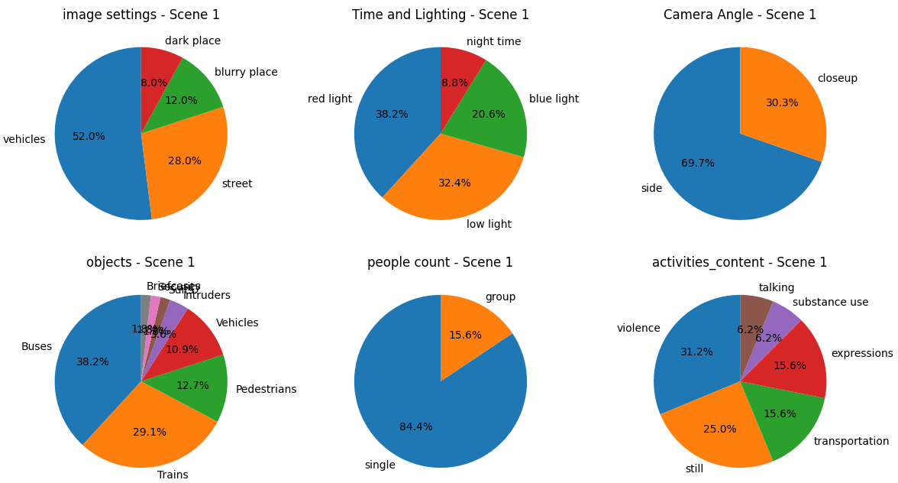
##### Scene 1 Text Analysis
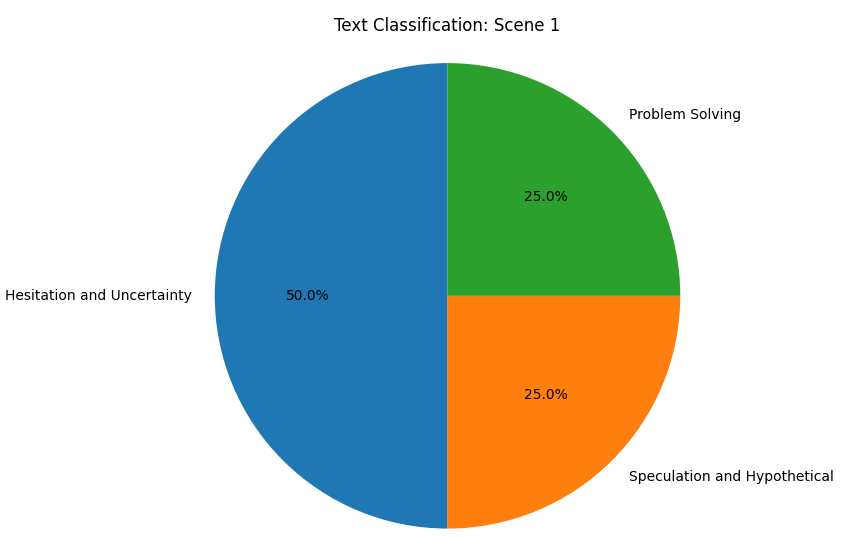

##### Scene 2 Image Analysis
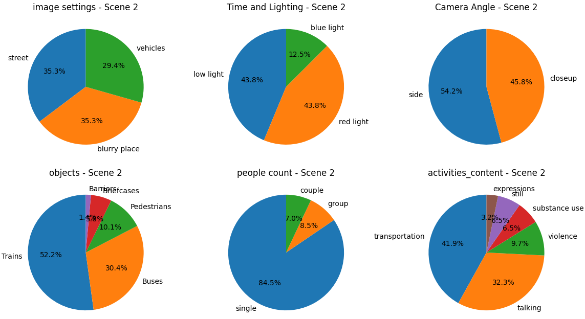
##### Scene 2 Text Analysis
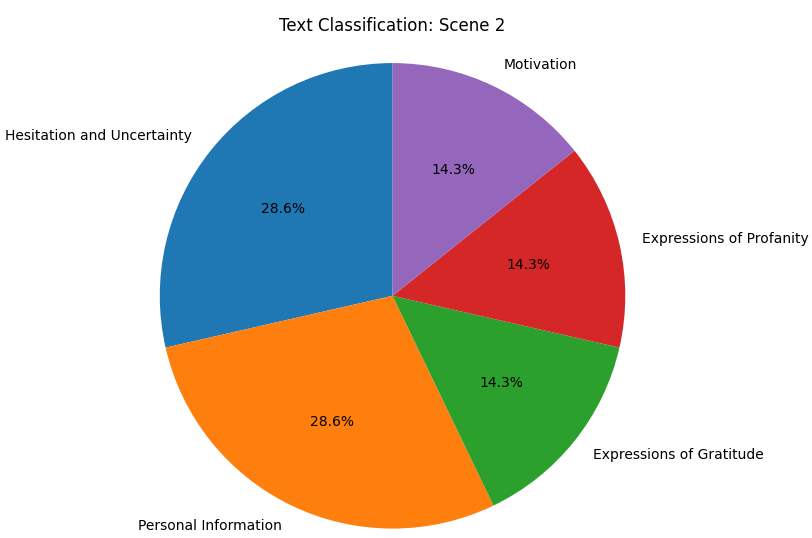

##### Scene 3 Image Analysis
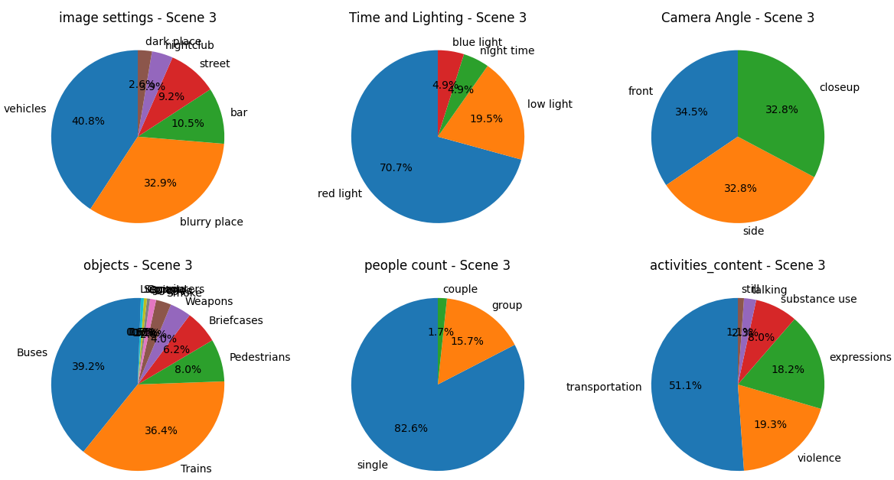
##### Scene 3 Text Analysis
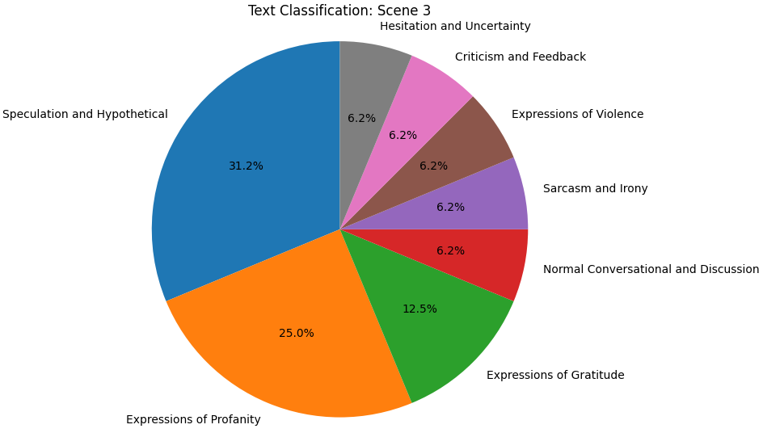

##### Scene 4 Text Analysis
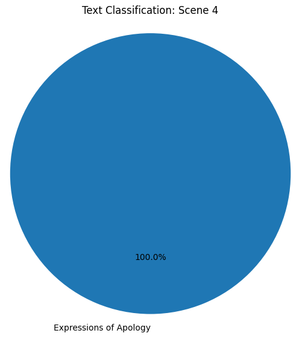


### Output
#### Test Video 2
##### Scene 1 Image Analysis
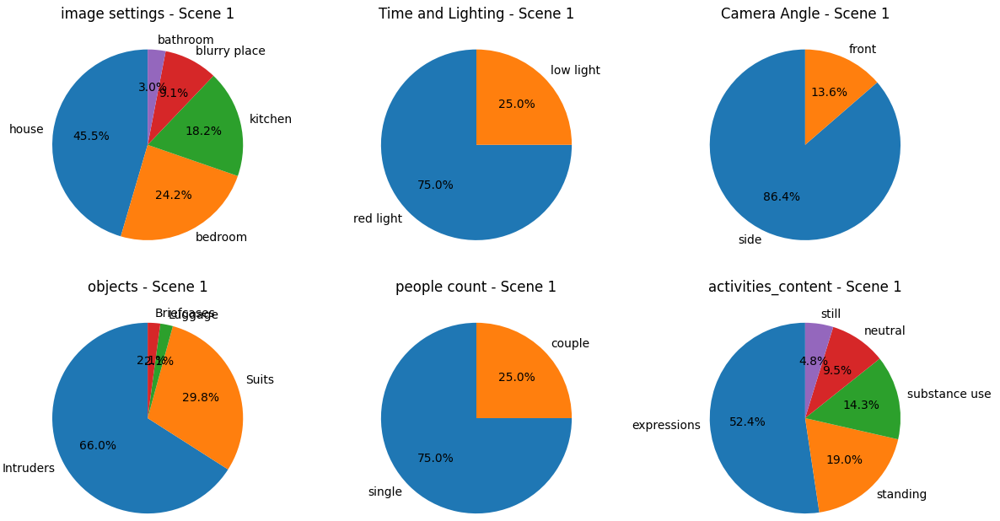
##### Scene 1 Text Analysis
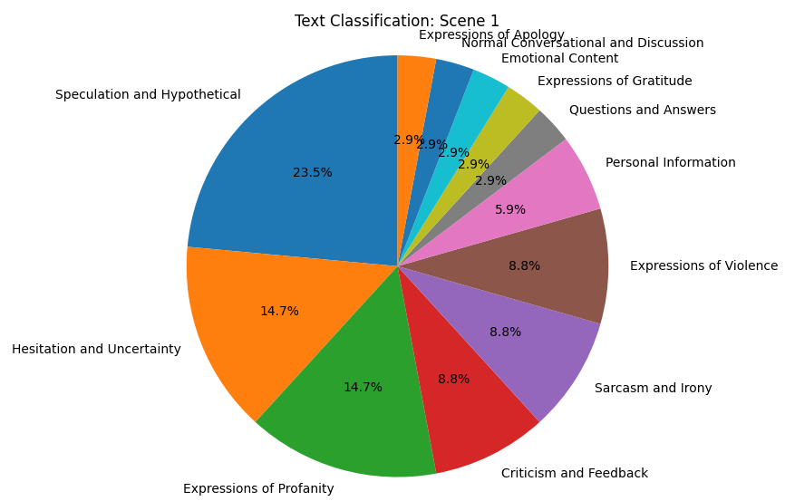

##### Scene 2 Image Analysis
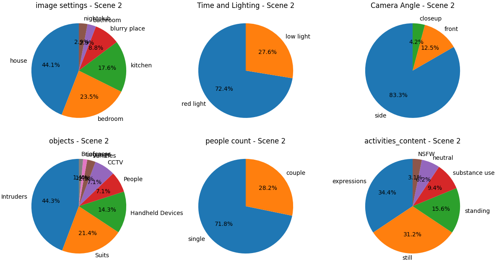
##### Scene 2 Text Analysis
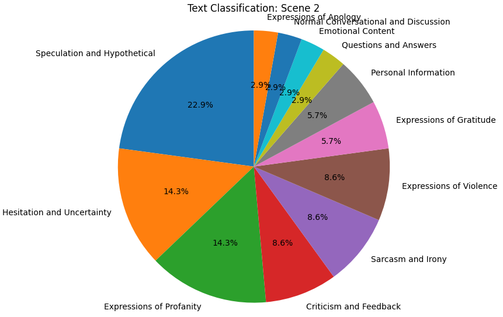

### Citation
If you find this code useful in your research, please consider citing it as:
```
@misc{akewarmayur/VideoIntelligence,
  author = {Mayur Akewar, Prof. Manoj Chandak},
  title = {VideoIntelligence},
  year = {2023},
  publisher = {GitHub},
  journal = {GitHub Repository},
  howpublished = {\url{https://github.com/akewarmayur/VideoIntelligence/}},
}
```

